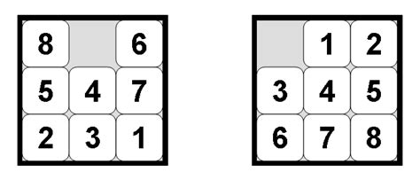

# Modelling a decision problem

### Homework
We have a 3x3 matrix with 8 cells numbered 1 to 8 and one empty cell. Knowing that the initial position of the cells is random and that we can move a cell only in place of the empty cell and only if it is adjacent to it, find, if there is one, a sequence of moves such that all cells are placed in ascending order in the matrix. After a cell is moved it cannot be moved again until one of its neighbors has been moved. The position of the empty cell does not matter for final state validation.

Use these instances for testing: [8, 6, 7, 2, 5, 4, 0, 3, 1], [2, 5, 3, 1, 0, 6, 4, 7, 8] and [2, 7 , 5, 0, 8, 4, 3, 1, 6].

**Requirements**:
1. Choose a representation of a state of the problem. The representation must be explicit enough to contain all the necessary information to continue finding a solution, but it must also be formal enough to be easy to process/store.
2. Identify the special states (initial and final) and implement the initialization function (takes as parameters the problem instance, returns the initial state) and the boolean function that checks whether a state received as a parameter is final.
3. Implement transitions as functions that take a state and transition parameters and return the state resulting from applying the transition. Validation of transitions is done in one or more boolean functions with the same parameters.
4. Implement the IDDFS strategy.
5. Implement the Greedy strategy and test at least three heuristics: Manhattan distance, Hamming distance, plus at least one other.
6. Implement a program that runs all 4 strategies (IDDFS and Greedy with the three heuristics) for the three instances and displays the solution size (if found) and execution time for each of the 4 strategies.

**Useful resources**:
* https://deniz.co/8-puzzle-solver/
* https://www.geeksforgeeks.org/iterative-deepening-searchids-iterative-deepening-depth-first-searchiddfs/
* http://www.ieee.ma/uaesb/pdf/distances-in-classification.pdf
