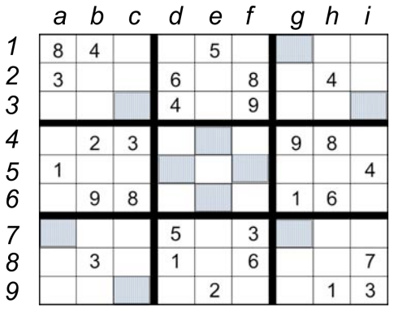
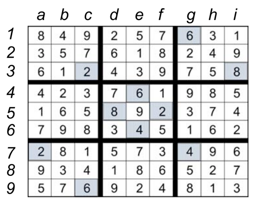

# Constraint Satisfaction Problem

### Homework
Consider a board of size 9x9, partially filled with digits from 1 to 9. Each row, column, or 3x3 sub-region contains all values from 1 to 9. Certain cells must contain an even number. The problem consists in identifying the missing numbers.
Apply the Forward checking algorithm together with a variable ordering method to determine the solutions of a given instance.

Example:\

The solution of the instance:\

**Requirements**:
1. Model the problem as a constraint satisfaction problem
   * identify the variables, the domains, the constraints
   * initialize them for a given instance
2. Implement the *Forward checking* method.
3. Implement a variable ordering method.
